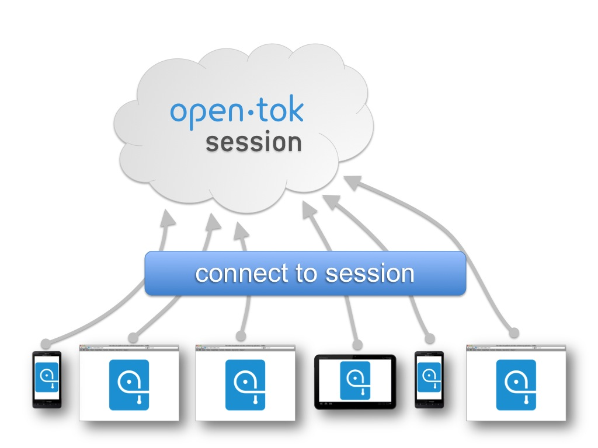
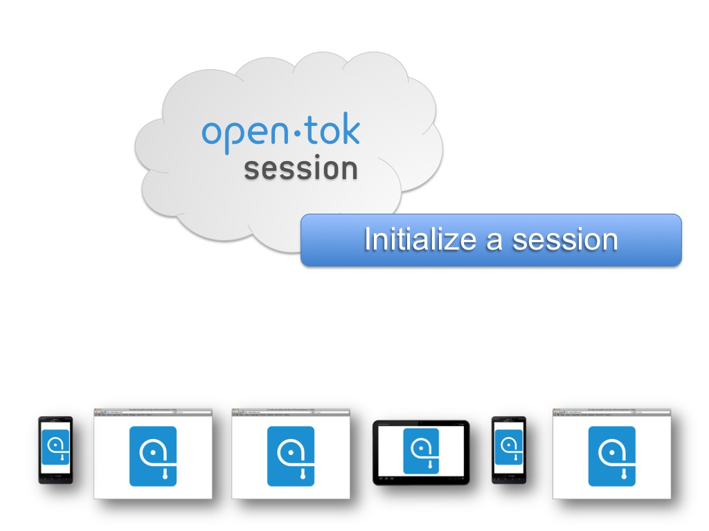
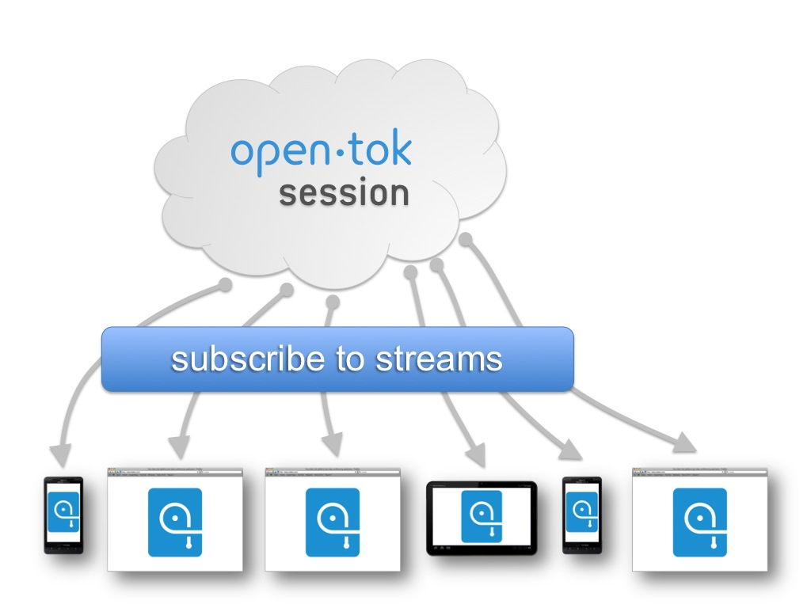

!SLIDE architecture

	@@@ javascript
	// Init and connect to session
	var session = TB.initSession(sessionId);
	session.connect(apiKey, token);

!SLIDE architecture

	@@@ javascript
	// Publish webcam stream to session
	session.publish(replacementDivId);
	
!SLIDE architecture

	@@@ javascript
	// Listen for stream created event
	session.addEventListener('streamCreated', 
		streamCreatedHandler);
	
!SLIDE architecture smaller

	@@@ javascript
	// Subscribe to all new streams
	function streamCreatedHandler(event) {
		for (var i = 0; i < event.streams.length; i++) {
			session.subscribe(event.streams[i], divId + i);
		}
	}